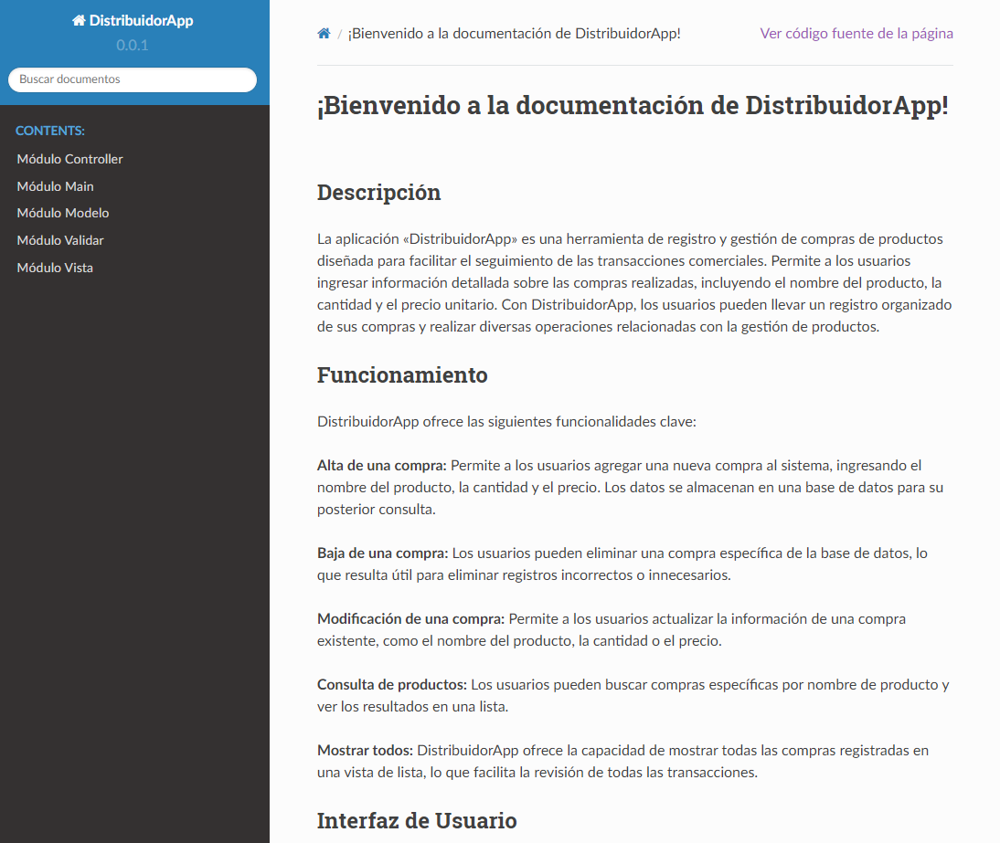

# Welcome to DistribuidorApp Documentation!


## Description

The "DistribuidorApp" is a product purchase registration and management tool designed to facilitate tracking business transactions. It allows users to enter detailed information about purchases, including product name, quantity, and unit price. With DistribuidorApp, users can keep an organized record of their purchases and perform various operations related to product management.

## Features

DistribuidorApp offers the following key features:

**Add a Purchase:** Users can add a new purchase to the system by entering the product name, quantity, and price. The data is stored in a database for future reference.

**Delete a Purchase:** Users can remove a specific purchase from the database, which is useful for deleting incorrect or unnecessary records.

**Update a Purchase:** Users can update existing purchase information, such as the product name, quantity, or price.

**Search for Products:** Users can search for specific purchases by product name and view the results in a list.

**Show All:** DistribuidorApp provides the ability to display all registered purchases in a list view, making it easy to review all transactions.

## User Interface

DistribuidorApp's user interface is based on Python's Tkinter library, providing a user-friendly and easy-to-use graphical experience. The interface elements include labels, text entries, buttons, and a treeview to display purchase records in an organized manner.

## How to Use the Interface

Users can interact with the DistribuidorApp interface as follows:

1. **Start the application:** Running the application opens the main window of DistribuidorApp.
2. **Add a Purchase:** To register a new purchase, the user must enter the product name, quantity, and price in the appropriate fields and click the "Add" button.
3. **Delete a Purchase:** To delete an existing purchase, the user must select the desired purchase in the treeview and click the "Delete" button.
4. **Update a Purchase:** To update purchase details, the user must select the desired purchase in the treeview, make the necessary changes in the input fields, and click the "Update" button.
5. **Search for Products:** To search for specific purchases by product name, the user must enter the name in the search field and click the "Search" button.
6. **Show All:** The "Show All" button allows the user to view all registered purchases in the treeview.

## Running the Application

To run DistribuidorApp, follow these steps:

1. Make sure you have Python installed on your system.
2. Open a terminal or command prompt.
3. Navigate to the directory where the DistribuidorApp source code is located.
4. Run the main module, for example:

   ```shell
   python main.py

This will start the application and open the main window of DistribuidorApp.

Now you're ready to start using DistribuidorApp to efficiently manage your product purchases!

> **Note:**  
> Make sure to have the Tkinter library and the Peewee ORM installed in your Python environment before running the application.

## Contents

- controller
- main
- modelo
- validar
- vista

## Find the complete and interactive documentation in spanish [here](https://github.com/AgustinNR/distribuidor_app_abmc/blob/main/DistribuidorApp/docs/_build/html/index.html)!


